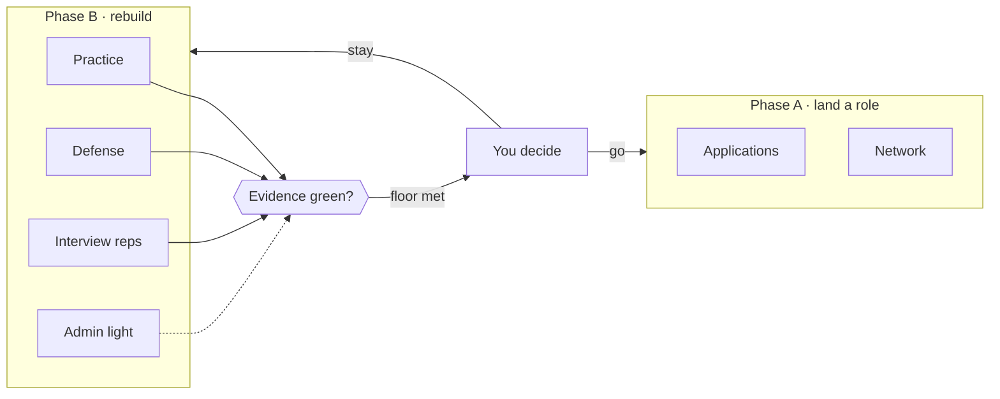
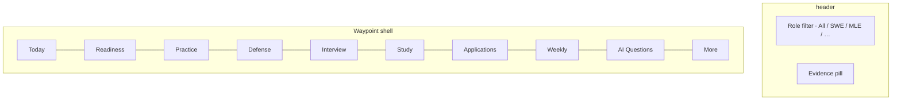
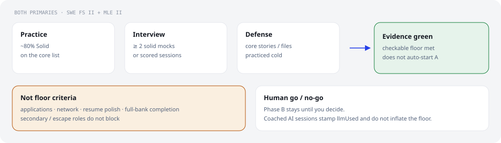
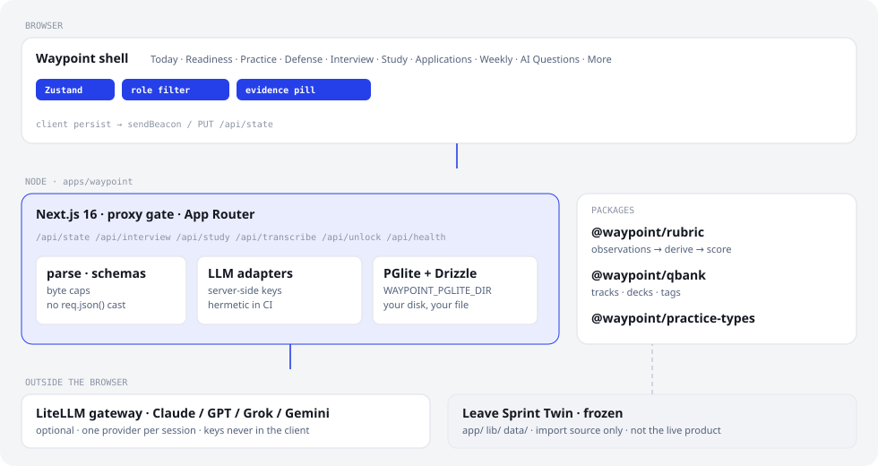
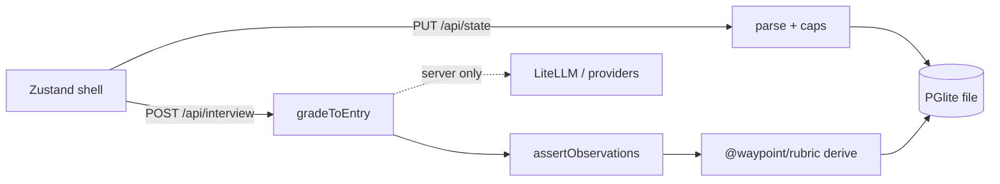
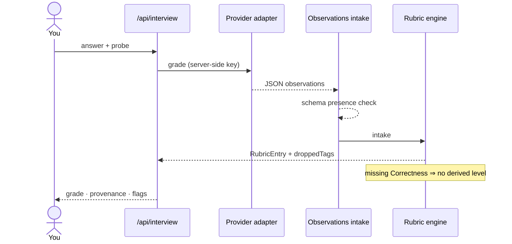
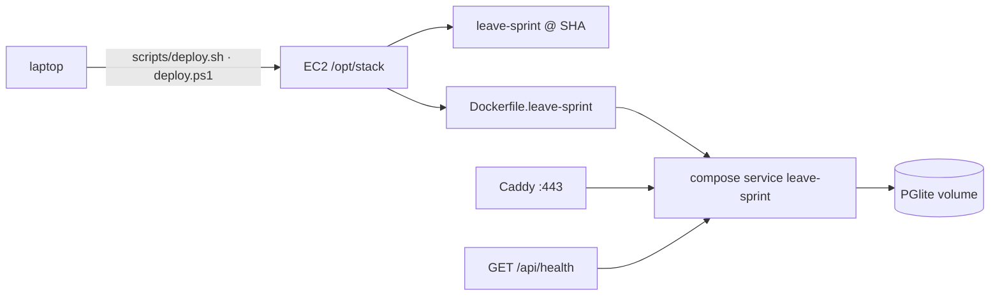

<p align="center">
  
</p>

<p align="center">
  <strong>Local-first career hub.</strong> Rebuild readiness (phase B), then land a role (phase A).<br/>
  Your grades live in embedded PGlite on <em>your</em> machine. Not a 29-day leave countdown.
</p>

<p align="center">
  <a href="https://github.com/markwuenschel-dev/leave-sprint/actions/workflows/ci.yml"></a>
  <a href="https://leavesprint.44-198-76-44.nip.io/api/health"></a>
  
  
  
  
  
  
  
  
  
</p>

<p align="center">
  <a href="#quick-start">Start</a> ·
  <a href="#shell">Shell</a> ·
  <a href="#evidence-floor">Evidence floor</a> ·
  <a href="#architecture">Architecture</a> ·
  <a href="#ai-interviewer">AI Interviewer</a> ·
  <a href="#deploy">Deploy</a> ·
  <a href="#verify">Verify</a>
</p>

---

## What this is

**Waypoint** (`apps/waypoint`, `@waypoint/*`) is the live product: a personal hub for a career transition. You practice, defend files, sit interview reps, and watch a **hybrid evidence floor** for two primary roles (SWE Full Stack II and MLE II). Crossing green does **not** flip you into applications — you still decide the go / no-go.

**Leave Sprint Twin** (`app/`, root `lib/`, `data/`) is frozen scaffolding. Import source only. Not the daily driver.

Always **pnpm**.



---

## Quick start

```bash
pnpm install
pnpm dev          # http://localhost:3210 — apps/waypoint
pnpm build
pnpm start        # migrate PGlite, then next start
```

No required env for local dev. Empty `.env` → embedded DB, open gate, no LLM providers. A production build (`NODE_ENV=production`) needs `APP_TOKEN` set — an unset token no longer opens the app there (INT-002).

| Want | Do |
| --- | --- |
| Gate the site | `APP_TOKEN=…` in repo-root `.env` · unlock at `/unlock` or `?token=` once |
| Pin the database | `WAYPOINT_PGLITE_DIR=/absolute/path` — unset means `<cwd>/.pglite` |
| AI mocks | LiteLLM gateway (below) or raw provider keys |

---

## Shell

Live tabs in `apps/waypoint/app/page.tsx`:



| Tab | Job |
| --- | --- |
| **Today** | Rolling checklist: Practice · Defense · Interview reps · Admin light |
| **Readiness** | Hybrid floor for both primaries + the B→A go/no-go |
| **Practice** | Problem bank / solidity |
| **Defense** | File and story defense |
| **Interview** | Q-bank, grade, history, gaps, retest, performance |
| **Study** | Deterministic study digest |
| **Applications** | One row = one role + company |
| **Weekly** | Weekly review |
| **AI Questions** | AI Interviewer (examiner, not the Interview tab) |
| **More** | Export / import JSON, twin import, about |

Rhythm checkboxes are cadence. They are not the evidence floor.

---

## Evidence floor

<p align="center">
  
</p>

**Evidence green** (both primaries):

1. Practice solidity ≈ 80% Solid on a core list
2. Interview performance ≥ 2 solid mocks / scored sessions
3. Core stories / file defense practiced cold

Applications, network, resume polish, and finishing the whole bank are **not** floor criteria. Secondary and escape roles do not block.

Coached AI sessions stamp `llmIndependence.llmUsed: true` and do not inflate the floor. Glossary: [`CONTEXT.md`](CONTEXT.md).

---

## Architecture

<p align="center">
  
</p>
<!-- diagram still shows the retired twin as of INT-001; regenerate when convenient -->

```text
apps/waypoint/              live Next app
packages/rubric/            @waypoint/rubric   · observations + derive + score
packages/qbank/             @waypoint/qbank
packages/practice-types/    @waypoint/practice-types
docs/adr/                   accepted decisions
```



Persist is file-backed PGlite. Backup the directory, or **More → Export JSON**. One node. Not a multi-instance DB.

---

## AI Interviewer

An LLM examiner across Q-bank tracks. **Augmenting** evidence, not the source of truth. One provider per session plays ask → probe → grade. Answers are unaided by default.

The model emits **observations**. The engine scores. Provenance is stamped (who asked, who graded).



ADRs: [0001 evidence](docs/adr/0001-ai-interviewer-evidence-policy.md) · [0002 providers](docs/adr/0002-ai-interviewer-provider-architecture.md) · [0003 flow](docs/adr/0003-ai-interviewer-interview-flow.md) · [0004 observations](docs/adr/0004-ai-interviewer-observations-contract.md).

### LiteLLM gateway (preferred)

From [litellm-langfuse-gateway](https://github.com/markwuenschel-dev/litellm-langfuse-gateway), then repo-root `.env`:

```env
LITELLM_BASE_URL=http://localhost:4000/v1
LITELLM_VIRTUAL_KEY=sk-...   # virtual key from `llg keys create`
```

When the virtual key is set, providers route through the gateway. You do not need raw `OPENAI_API_KEY` / etc. in this repo for chat/grade. Dictation still wants `OPENAI_API_KEY` (Whisper).

CI sets `LLG_HERMETIC=1`. Tests never bill.

See `.env.example` and `apps/waypoint/lib/llm/registry.ts`.

---

## Deploy

Local-first still means **your** server. Production on this repo is a Compose service `leave-sprint` on a single EC2 box, PGlite volume, Caddy in front.



```bash
./scripts/deploy.sh              # latest main
./scripts/deploy.sh <sha>        # pin / roll back
# PowerShell: .\scripts\deploy.ps1
```

Scripts SSH to the box, sync the clone, `docker compose up -d --build leave-sprint`, then retry `GET /api/health` through migrate+start warmup.

Bare Node + systemd is documented as an alternate single-box recipe (not what the scripts run):

```bash
pnpm install
pnpm --filter waypoint build
export WAYPOINT_PGLITE_DIR=/var/lib/waypoint/pglite
export APP_TOKEN='strong-secret'
mkdir -p "$WAYPOINT_PGLITE_DIR"
pnpm --filter waypoint start     # 0.0.0.0 · PORT 3000
```

Put nginx/Caddy in front. Multi-instance needs a different DB story.

---

## Verify

Same sequence CI runs (`.github/workflows/ci.yml`):

| Gate | Command |
| --- | --- |
| Lint | `pnpm lint` |
| Typecheck | `pnpm typecheck` |
| Tests | `pnpm test` |
| Waypoint | `pnpm --filter waypoint build` |

Hermetic: `LLG_HERMETIC=1` in CI. No live LLM on the verify job.

---

## Twin

The frozen "Leave Sprint Twin" predecessor (29-day leave dashboard) was retired from this repo (INT-001) — it had zero live import dependency from Waypoint and its own rubric/qbank copies had already drifted from `@waypoint/rubric`/`@waypoint/qbank`. Its history is fully recoverable from git (`git show <pre-removal-commit>:data/app-state.json`, etc.) if ever needed.

The one-shot import feature itself is unaffected: **More → twin import** still works, backed by `apps/waypoint/lib/twinImport.ts`, which was always independent of the twin's own application code — it parses an exported JSON payload (practice progress + rubric history only), not a live twin instance.

---

## Decisions

Product notes: `.scratch/career-transition-hub/`. Domain words: [`CONTEXT.md`](CONTEXT.md). Scoring spec: `Technical_Competency_Scoring_System_v1_11.md`.
